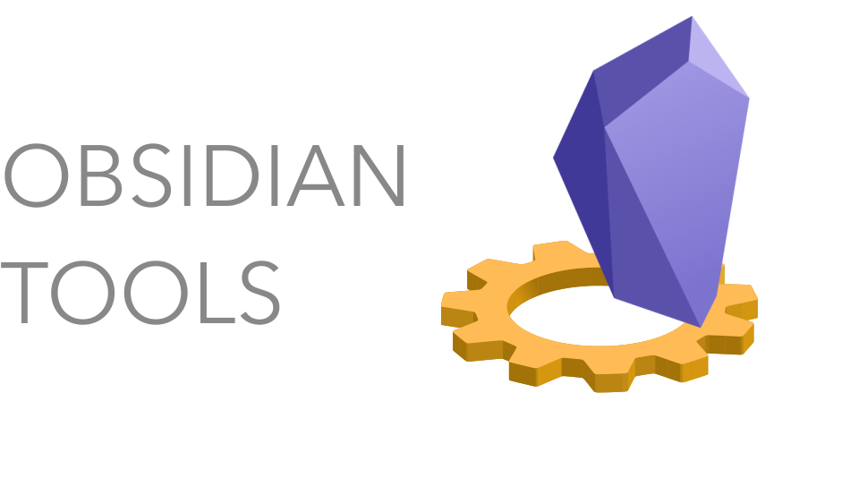

<!-- ALL-CONTRIBUTORS-BADGE:START - Do not remove or modify this section -->

<!-- ALL-CONTRIBUTORS-BADGE:END -->

A collection of tools that helps devs build plugins for obsidian

## Included packages

- **create-obsidian-plugin**: Allows one to do `yarn create obsidian-plugin` or `npm init obsidian-plugin` to get a fully formed plugin scaffolding
- **obsidian-plugin-cli**: A cli tool that provides a complete plugin development experience out of the box.
- **obsidian-utils**: A collection of utilities such as getting information about an installed plugin, getting information about a plugin in obsidian's plugin registry, or programmatically installing a plugin
- **auto-plugin-obsidian**: A plugin for [auto](https://github.com/intuit/auto) that autmomates the release process for an obsidian plugin

## Contributors ✨

Thanks goes to these wonderful people ([emoji key](https://allcontributors.org/docs/en/emoji-key)):

<!-- ALL-CONTRIBUTORS-LIST:START - Do not remove or modify this section -->
<!-- prettier-ignore-start -->
<!-- markdownlint-disable -->
<table>
  <tr>
    <td align="center"><a href="https://github.com/zephraph"> <b>Justin Bennett</b></a> <a href="https://github.com/zephraph/obsidian-tools/commits?author=zephraph" title="Code">💻</a> <a href="https://github.com/zephraph/obsidian-tools/commits?author=zephraph" title="Documentation">📖</a> <a href="#infra-zephraph" title="Infrastructure (Hosting, Build-Tools, etc)">🚇</a> <a href="https://github.com/zephraph/obsidian-tools/commits?author=zephraph" title="Tests">⚠️</a></td>
    <td align="center"><a href="http://hipstersmoothie.com/"> <b>Andrew Lisowski</b></a> <a href="https://github.com/zephraph/obsidian-tools/commits?author=hipstersmoothie" title="Documentation">📖</a> <a href="https://github.com/zephraph/obsidian-tools/commits?author=hipstersmoothie" title="Code">💻</a></td>
  </tr>
</table>

<!-- markdownlint-restore -->
<!-- prettier-ignore-end -->

<!-- ALL-CONTRIBUTORS-LIST:END -->

This project follows the [all-contributors](https://github.com/all-contributors/all-contributors) specification. Contributions of any kind welcome!
